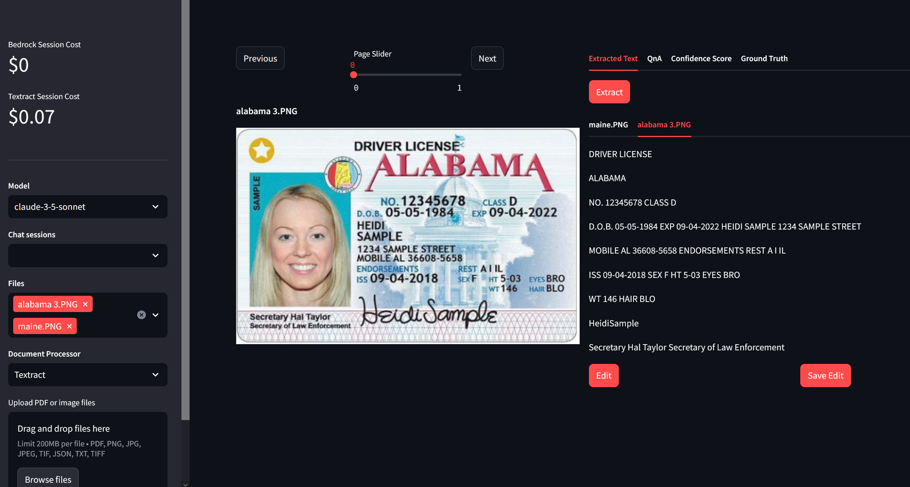

# Intelligent Document Analysis



Intelligent Document Analysis is an innovative AI-powered application designed to revolutionize document processing and analysis in the medical insurance domain. With this solution, insurance claims agents can efficiently summarize documents, extract key information, and provide prompt customer support through an intelligent Q&A interface.

## Features

- **Document Textract:** Uses Amazon Textract to extract document content.
- **Intelligent Q&A Interface:** Ask questions and retrieve relevant answers from uploaded documents, facilitating faster decision-making.
- **Confidence Scores:** Parses the confidence score of each word into a table.
- **Multi-Session Chat:** Provide a personalized document chat interface for each user, maintaining conversation context and history for efficient customer support.
- **Cost Tracking:** Monitor and control expenses by tracking token usage and estimating costs based on the AI models used.

## PreRequisite
Set up the necessary cloud services:
   - [Amazon S3 for file storage](https://docs.aws.amazon.com/AmazonS3/latest/userguide/create-bucket-overview.html)
   - Amazon Textract
   - Amazon DynamoDB (Run `resources.ipynb` notebook to create a DynamoDB Table)
   - [Amazon Bedrock Anthropic Claude Model Access](https://docs.aws.amazon.com/bedrock/latest/userguide/model-access.html)

## Installation

### To run this Streamlit App on Sagemaker Studio follow the steps below:

1. [Set Up SageMaker Studio](https://docs.aws.amazon.com/sagemaker/latest/dg/onboard-quick-start.html) 
2. SageMaker execution role should have access to interact with [Bedrock](https://docs.aws.amazon.com/bedrock/latest/userguide/api-setup.html), [Textract](https://docs.aws.amazon.com/aws-managed-policy/latest/reference/AmazonTextractFullAccess.html), [DynamoDB](https://docs.aws.amazon.com/amazondynamodb/latest/developerguide/iam-policy-specific-table-indexes.html), and [S3](https://docs.aws.amazon.com/AmazonS3/latest/userguide/access-policy-language-overview.html).
3. [Launch SageMaker Studio](https://docs.aws.amazon.com/sagemaker/latest/dg/studio-launch.html)

4. Clone the repository:
   ```
   git clone ...
   ```
5. Open a system terminal by clicking on **Amazon SageMaker Studio** and then **System Terminal** as shown in the diagram below
* 
6. Navigate into the cloned repository directory using the `cd` command and run the command `pip install -r req.txt` to install the needed python libraries
7. Configure the application:
   - Update the `config.json` file with your preferences.
       - `DynamodbTable`: The name of the DynamoDB table used for storing chat history.
       - `UserId`: The default user ID for the application (assign any name of your choosing).
       - `Bucket_Name`: The name of the S3 bucket used for caching uploaded documents, extracted text and input files to be rendered on screen.
       - `max-output-token`: The maximum number of output tokens allowed for the AI assistant's response.        
       - `chat-history-loaded-length`: The number of recent chat messages to load from the DynamoDB table.
       - `bedrock-region`: The AWS region where the Bedrock runtime is deployed.
       - `s3_path_prefix`: The S3 bucket path where uploaded documents are stored (without the trailing foward slash). 
       - `textract_output`: The S3 bucket path where the extracted content by Textract are stored (without the trailing foward slash).
       - `input_s3_path`: The S3 prefix (without the trailing foward slash) containing files in S3 to render on screen.
8. Run command `python3 -m streamlit run medical-sum.py --server.enableXsrfProtection false --server.enableCORS  false` to start the Streamlit server. Do not use the links generated by the command as they won't work in studio.
9. To enter the Streamlit app, open and run the cell in the **StreamlitLink.ipynb** notebook. This will generate the appropiate link to enter your Streamlit app from SageMaker studio. Click on the link to enter your Streamlit app.
**⚠ Note:**  If you rerun the Streamlit server it may use a different port. Take not of the port used (port number is the last 4 digit number after the last : (colon)) and modify the `port` variable in the `StreamlitLink.ipynb` notebook to get the correct link.

### To run this Streamlit App on AWS EC2 (I tested this on the Ubuntu Image)
* [Create a new ec2 instance](https://docs.aws.amazon.com/AWSEC2/latest/UserGuide/EC2_GetStarted.html)
* Expose TCP port range 8500-8510 on Inbound connections of the attached Security group to the ec2 instance. TCP port 8501 is needed for Streamlit to work. See image below
* 
* [Connect to your ec2 instance](https://docs.aws.amazon.com/AWSEC2/latest/UserGuide/AccessingInstances.html)
* Run the appropiate commands to update the ec2 instance (`sudo apt update` and `sudo apt upgrade` -for Ubuntu)
* Clone this git repo `git clone [github_link]`
* Install python3 and pip if not already installed
* EC2 [instance profile role](https://docs.aws.amazon.com/IAM/latest/UserGuide/id_roles_use_switch-role-ec2_instance-profiles.html) has the required permissions to access the services used by this application mentioned above.
* Install the dependencies in the requirements.txt file by running the command `sudo pip install -r req.txt`
Configure the application:
* Update the `config.json` file with your preferences using the `nano config.json` command.
    - `DynamodbTable`: The name of the DynamoDB table used for storing chat history.
    - `UserId`: The default user ID for the application (assign any name of your choosing).
    - `Bucket_Name`: The name of the S3 bucket used for caching uploaded documents, extracted text and input files to be rendered on screen.
    - `max-output-token`: The maximum number of output tokens allowed for the AI assistant's response.        
    - `chat-history-loaded-length`: The number of recent chat messages to load from the DynamoDB table.
    - `bedrock-region`: The AWS region where the Bedrock runtime is deployed.
    - `s3_path_prefix`: The S3 bucket path where uploaded documents are stored (without the trailing foward slash). 
    - `textract_output`: The S3 bucket path where the extracted content by Textract are stored (without the trailing foward slash).
    - `input_s3_path`: The S3 prefix (without the trailing foward slash) containing files in S3 to render on screen.
* Run command `tmux new -s mysession`. Then in the new session created `cd` into the **idp-textract** dir and run `python3 -m streamlit run medical-sum.py` to start the streamlit app. This allows you to run the Streamlit application in the background and keep it running even if you disconnect from the terminal session.
* Copy the **External URL** link generated and paste in a new browser tab.
To stop the `tmux` session, in your ec2 terminal Press `Ctrl+b`, then `d` to detach. to kill the session, run `tmux kill-session -t mysession`

## License

This project is licensed under the [MIT License](LICENSE).
